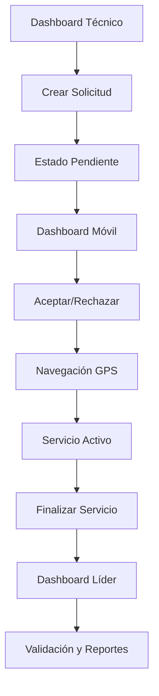

# Synapsis Apoyos - Documento de Requerimientos del Producto

## 1. Descripción General del Producto

Synapsis Apoyos es una aplicación web de servicios de apoyo técnico que conecta técnicos que necesitan asistencia con móviles de apoyo disponibles, similar a plataformas como Uber o Didi.

La aplicación resuelve el problema de coordinación eficiente entre técnicos de campo que requieren apoyo (escaleras, equipos) y las unidades móviles disponibles para brindar dicha asistencia.

Objetivo: Optimizar los tiempos de respuesta y mejorar la eficiencia operativa en servicios de apoyo técnico mediante geolocalización en tiempo real y gestión automatizada de solicitudes.

## 2. Características Principales

### 2.1 Roles de Usuario

| Rol | Método de Registro | Permisos Principales |
|-----|-------------------|---------------------|
| Técnico | Registro con credenciales corporativas | Crear solicitudes de apoyo, ver mapa de móviles cercanas, recibir notificaciones |
| Móvil de Apoyo | Registro con credenciales y vehículo asignado | Ver solicitudes cercanas, aceptar/rechazar servicios, gestionar rutas y tiempos |
| Líder | Acceso administrativo | Supervisar operaciones, generar reportes, validar observaciones y métricas |

### 2.2 Módulos de Funcionalidad

Nuestra aplicación de apoyo técnico consta de las siguientes páginas principales:

1. **Dashboard Técnico**: mapa en tiempo real, formulario de solicitud, historial de servicios, notificaciones.
2. **Dashboard Móvil de Apoyo**: mapa con solicitudes cercanas, gestión de servicios activos, navegación GPS, historial.
3. **Dashboard Líder**: mapa general de operaciones, reportes y métricas, validación de servicios, análisis histórico.
4. **Página de Autenticación**: login diferenciado por roles, recuperación de contraseña.
5. **Página de Perfil**: gestión de datos personales, configuraciones, estado de disponibilidad.

### 2.3 Detalles de Páginas

| Nombre de Página | Nombre del Módulo | Descripción de Funcionalidad |
|------------------|-------------------|------------------------------|
| Dashboard Técnico | Mapa en Tiempo Real | Mostrar ubicación de móviles cercanas, actualización automática cada 30 segundos |
| Dashboard Técnico | Formulario de Solicitud | Crear solicitud especificando tipo de apoyo (escalera/equipos), ubicación GPS automática |
| Dashboard Técnico | Historial de Servicios | Listar solicitudes previas con estados, tiempos y observaciones |
| Dashboard Técnico | Sistema de Notificaciones | Recibir alertas cuando móvil acepta/rechaza solicitud, seguimiento en tiempo real |
| Dashboard Móvil | Mapa de Solicitudes | Ver solicitudes cercanas con distancia y tipo de apoyo requerido |
| Dashboard Móvil | Gestión de Servicios | Aceptar/rechazar solicitudes con observaciones obligatorias, control de estado activo |
| Dashboard Móvil | Navegación GPS | Mostrar ruta óptima al técnico, tiempo estimado de llegada, seguimiento en tiempo real |
| Dashboard Móvil | Control de Tiempo | Iniciar/finalizar servicio con límite de 1 hora, registro de observaciones finales |
| Dashboard Líder | Mapa General | Visualizar todas las móviles activas y solicitudes en curso en tiempo real |
| Dashboard Líder | Reportes y Métricas | Calcular porcentajes de aceptación/rechazo, tiempos promedio de respuesta |
| Dashboard Líder | Validación de Servicios | Revisar observaciones de servicios completados y rechazados |
| Dashboard Líder | Análisis Histórico | Generar reportes mensuales con filtros por estado y tipo de servicio |
| Autenticación | Login por Roles | Autenticar usuarios según rol asignado, redirección a dashboard correspondiente |
| Perfil | Gestión de Datos | Actualizar información personal, cambiar contraseña, configurar notificaciones |

## 3. Proceso Principal

### Flujo del Técnico
1. El técnico inicia sesión y accede a su dashboard
2. Crea una solicitud de apoyo especificando el tipo (escalera/equipos)
3. El sistema registra automáticamente su ubicación GPS
4. La solicitud queda en estado "Pendiente" por máximo 2 horas
5. Recibe notificación cuando una móvil acepta la solicitud
6. Puede seguir en tiempo real el acercamiento de la móvil
7. Confirma la llegada y finalización del servicio

### Flujo de Móvil de Apoyo
1. La móvil inicia sesión y ve solicitudes cercanas en el mapa
2. Selecciona una solicitud y puede aceptarla o rechazarla
3. Si rechaza, debe proporcionar observación obligatoria
4. Si acepta, no puede tomar otra solicitud hasta completar la actual
5. Navega hasta la ubicación del técnico usando GPS
6. Inicia el servicio al llegar (máximo 1 hora para completar)
7. Registra observaciones y finaliza el servicio

### Flujo del Líder
1. Accede al dashboard de supervisión general
2. Monitorea en tiempo real todas las operaciones activas
3. Revisa métricas de rendimiento y tiempos de respuesta
4. Valida observaciones de servicios completados
5. Genera reportes históricos con filtros personalizados

## 4. Diseño de Interfaz de Usuario

### 4.1 Estilo de Diseño

- **Colores primarios**: Azul corporativo (#2563EB), Verde éxito (#10B981)
- **Colores secundarios**: Gris neutro (#6B7280), Rojo alerta (#EF4444)
- **Estilo de botones**: Redondeados con sombras sutiles, efectos hover
- **Fuente**: Inter o Roboto, tamaños 14px-18px para texto, 24px-32px para títulos
- **Estilo de layout**: Diseño tipo dashboard con navegación lateral, tarjetas para información
- **Iconos**: Material Design Icons, estilo outline para consistencia

### 4.2 Resumen de Diseño de Páginas

| Nombre de Página | Nombre del Módulo | Elementos de UI |
|------------------|-------------------|----------------|
| Dashboard Técnico | Mapa en Tiempo Real | Mapa interactivo pantalla completa, marcadores azules para móviles, botón flotante "Solicitar Apoyo" |
| Dashboard Técnico | Formulario de Solicitud | Modal centrado, dropdown tipo de apoyo, campo observaciones, botón primario "Enviar Solicitud" |
| Dashboard Móvil | Mapa de Solicitudes | Mapa con marcadores rojos para solicitudes, panel lateral con lista detallada, filtros por distancia |
| Dashboard Móvil | Gestión de Servicios | Tarjetas de solicitud con botones "Aceptar" (verde) y "Rechazar" (rojo), modal para observaciones |
| Dashboard Líder | Mapa General | Vista panorámica con leyenda de colores, panel de métricas en tiempo real, filtros temporales |
| Dashboard Líder | Reportes | Gráficos tipo donut para porcentajes, tablas responsivas, exportación PDF/Excel |

### 4.3 Responsividad

La aplicación está diseñada mobile-first con adaptación completa para tablets y desktop. Se optimiza la interacción táctil para móviles de apoyo que operan desde vehículos, con botones de tamaño mínimo 44px y navegación simplificada.