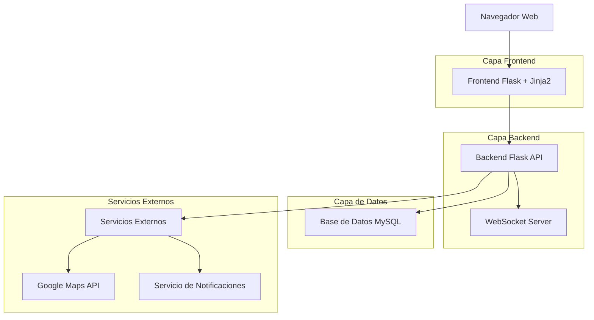
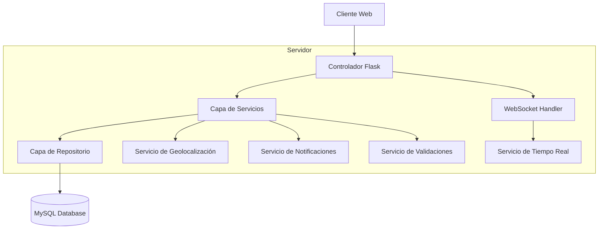
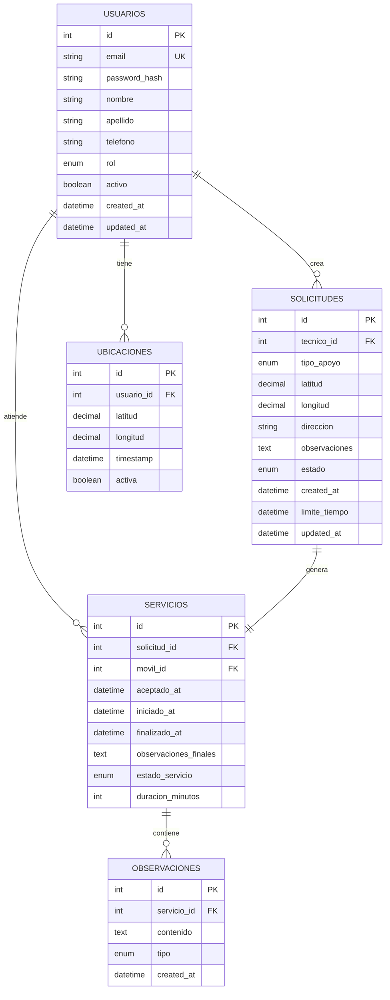

# Synapsis Apoyos - Documento de Arquitectura Técnica

## 1. Diseño de Arquitectura



## 2. Descripción de Tecnologías

- **Frontend**: Flask@2.3 + Jinja2 + Bootstrap@5.3 + JavaScript ES6
- **Backend**: Flask@2.3 + Flask-SocketIO + Flask-SQLAlchemy + Flask-Login
- **Base de Datos**: MySQL@8.0
- **Tiempo Real**: WebSocket (Socket.IO)
- **Mapas**: Google Maps JavaScript API
- **Autenticación**: Flask-Login + bcrypt

## 3. Definiciones de Rutas

| Ruta | Propósito |
|------|----------|
| / | Página de inicio, redirección según autenticación |
| /login | Página de autenticación por roles |
| /logout | Cerrar sesión y limpiar cookies |
| /dashboard/tecnico | Dashboard principal para técnicos |
| /dashboard/movil | Dashboard principal para móviles de apoyo |
| /dashboard/lider | Dashboard principal para líderes |
| /perfil | Gestión de perfil de usuario |
| /solicitud/crear | Formulario para crear nueva solicitud |
| /solicitud/historial | Historial de solicitudes del usuario |
| /servicio/activo | Gestión de servicio activo para móviles |
| /reportes | Módulo de reportes para líderes |

## 4. Definiciones de API

### 4.1 API Principal

**Autenticación de usuarios**
```
POST /api/auth/login
```

Request:
| Nombre Parámetro | Tipo Parámetro | Requerido | Descripción |
|------------------|----------------|-----------|-------------|
| email | string | true | Email del usuario |
| password | string | true | Contraseña en texto plano |
| role | string | true | Rol: 'tecnico', 'movil', 'lider' |

Response:
| Nombre Parámetro | Tipo Parámetro | Descripción |
|------------------|----------------|-------------|
| success | boolean | Estado de la autenticación |
| user_id | integer | ID del usuario autenticado |
| redirect_url | string | URL de redirección según rol |

**Crear solicitud de apoyo**
```
POST /api/solicitudes
```

Request:
| Nombre Parámetro | Tipo Parámetro | Requerido | Descripción |
|------------------|----------------|-----------|-------------|
| tipo_apoyo | string | true | 'escalera' o 'equipos' |
| latitud | float | true | Coordenada de latitud |
| longitud | float | true | Coordenada de longitud |
| observaciones | string | false | Detalles adicionales |

Response:
| Nombre Parámetro | Tipo Parámetro | Descripción |
|------------------|----------------|-------------|
| solicitud_id | integer | ID de la solicitud creada |
| estado | string | Estado inicial 'pendiente' |
| tiempo_limite | datetime | Tiempo límite (2 horas) |

**Obtener solicitudes cercanas**
```
GET /api/solicitudes/cercanas
```

Request:
| Nombre Parámetro | Tipo Parámetro | Requerido | Descripción |
|------------------|----------------|-----------|-------------|
| latitud | float | true | Ubicación actual de la móvil |
| longitud | float | true | Ubicación actual de la móvil |
| radio_km | integer | false | Radio de búsqueda (default: 10km) |

Response:
| Nombre Parámetro | Tipo Parámetro | Descripción |
|------------------|----------------|-------------|
| solicitudes | array | Lista de solicitudes cercanas |
| total | integer | Número total de solicitudes |

**Aceptar/Rechazar solicitud**
```
PUT /api/solicitudes/{id}/responder
```

Request:
| Nombre Parámetro | Tipo Parámetro | Requerido | Descripción |
|------------------|----------------|-----------|-------------|
| accion | string | true | 'aceptar' o 'rechazar' |
| observaciones | string | true si rechaza | Motivo de rechazo obligatorio |

Response:
| Nombre Parámetro | Tipo Parámetro | Descripción |
|------------------|----------------|-------------|
| success | boolean | Estado de la operación |
| nuevo_estado | string | Estado actualizado de la solicitud |

**Actualizar ubicación en tiempo real**
```
PUT /api/ubicacion
```

Request:
| Nombre Parámetro | Tipo Parámetro | Requerido | Descripción |
|------------------|----------------|-----------|-------------|
| latitud | float | true | Coordenada actual |
| longitud | float | true | Coordenada actual |
| timestamp | datetime | true | Momento de la ubicación |

Response:
| Nombre Parámetro | Tipo Parámetro | Descripción |
|------------------|----------------|-------------|
| success | boolean | Confirmación de actualización |

## 5. Arquitectura del Servidor



## 6. Modelo de Datos

### 6.1 Definición del Modelo de Datos



### 6.2 Lenguaje de Definición de Datos

**Tabla de Usuarios**
```sql
-- Crear base de datos
CREATE DATABASE synapsis_apoyos CHARACTER SET utf8mb4 COLLATE utf8mb4_unicode_ci;
USE synapsis_apoyos;

-- Tabla usuarios
CREATE TABLE usuarios (
    id INT AUTO_INCREMENT PRIMARY KEY,
    email VARCHAR(255) UNIQUE NOT NULL,
    password_hash VARCHAR(255) NOT NULL,
    nombre VARCHAR(100) NOT NULL,
    apellido VARCHAR(100) NOT NULL,
    telefono VARCHAR(20),
    rol ENUM('tecnico', 'movil', 'lider') NOT NULL,
    activo BOOLEAN DEFAULT TRUE,
    created_at TIMESTAMP DEFAULT CURRENT_TIMESTAMP,
    updated_at TIMESTAMP DEFAULT CURRENT_TIMESTAMP ON UPDATE CURRENT_TIMESTAMP
);

-- Índices para usuarios
CREATE INDEX idx_usuarios_email ON usuarios(email);
CREATE INDEX idx_usuarios_rol ON usuarios(rol);
CREATE INDEX idx_usuarios_activo ON usuarios(activo);
```

**Tabla de Solicitudes**
```sql
-- Tabla solicitudes
CREATE TABLE solicitudes (
    id INT AUTO_INCREMENT PRIMARY KEY,
    tecnico_id INT NOT NULL,
    tipo_apoyo ENUM('escalera', 'equipos') NOT NULL,
    latitud DECIMAL(10, 8) NOT NULL,
    longitud DECIMAL(11, 8) NOT NULL,
    direccion VARCHAR(500),
    observaciones TEXT,
    estado ENUM('pendiente', 'aceptada', 'rechazada', 'completada', 'cancelada', 'expirada') DEFAULT 'pendiente',
    created_at TIMESTAMP DEFAULT CURRENT_TIMESTAMP,
    limite_tiempo TIMESTAMP NOT NULL,
    updated_at TIMESTAMP DEFAULT CURRENT_TIMESTAMP ON UPDATE CURRENT_TIMESTAMP,
    FOREIGN KEY (tecnico_id) REFERENCES usuarios(id) ON DELETE CASCADE
);

-- Índices para solicitudes
CREATE INDEX idx_solicitudes_tecnico ON solicitudes(tecnico_id);
CREATE INDEX idx_solicitudes_estado ON solicitudes(estado);
CREATE INDEX idx_solicitudes_ubicacion ON solicitudes(latitud, longitud);
CREATE INDEX idx_solicitudes_created_at ON solicitudes(created_at DESC);
```

**Tabla de Servicios**
```sql
-- Tabla servicios
CREATE TABLE servicios (
    id INT AUTO_INCREMENT PRIMARY KEY,
    solicitud_id INT UNIQUE NOT NULL,
    movil_id INT NOT NULL,
    aceptado_at TIMESTAMP DEFAULT CURRENT_TIMESTAMP,
    iniciado_at TIMESTAMP NULL,
    finalizado_at TIMESTAMP NULL,
    observaciones_finales TEXT,
    estado_servicio ENUM('aceptado', 'en_ruta', 'en_sitio', 'completado', 'cancelado') DEFAULT 'aceptado',
    duracion_minutos INT DEFAULT 0,
    FOREIGN KEY (solicitud_id) REFERENCES solicitudes(id) ON DELETE CASCADE,
    FOREIGN KEY (movil_id) REFERENCES usuarios(id) ON DELETE CASCADE
);

-- Índices para servicios
CREATE INDEX idx_servicios_movil ON servicios(movil_id);
CREATE INDEX idx_servicios_estado ON servicios(estado_servicio);
CREATE INDEX idx_servicios_fechas ON servicios(aceptado_at, finalizado_at);
```

**Tabla de Ubicaciones**
```sql
-- Tabla ubicaciones
CREATE TABLE ubicaciones (
    id INT AUTO_INCREMENT PRIMARY KEY,
    usuario_id INT NOT NULL,
    latitud DECIMAL(10, 8) NOT NULL,
    longitud DECIMAL(11, 8) NOT NULL,
    timestamp TIMESTAMP DEFAULT CURRENT_TIMESTAMP,
    activa BOOLEAN DEFAULT TRUE,
    FOREIGN KEY (usuario_id) REFERENCES usuarios(id) ON DELETE CASCADE
);

-- Índices para ubicaciones
CREATE INDEX idx_ubicaciones_usuario ON ubicaciones(usuario_id);
CREATE INDEX idx_ubicaciones_timestamp ON ubicaciones(timestamp DESC);
CREATE INDEX idx_ubicaciones_activa ON ubicaciones(activa);
```

**Tabla de Observaciones**
```sql
-- Tabla observaciones
CREATE TABLE observaciones (
    id INT AUTO_INCREMENT PRIMARY KEY,
    servicio_id INT NOT NULL,
    contenido TEXT NOT NULL,
    tipo ENUM('rechazo', 'progreso', 'finalizacion') NOT NULL,
    created_at TIMESTAMP DEFAULT CURRENT_TIMESTAMP,
    FOREIGN KEY (servicio_id) REFERENCES servicios(id) ON DELETE CASCADE
);

-- Índices para observaciones
CREATE INDEX idx_observaciones_servicio ON observaciones(servicio_id);
CREATE INDEX idx_observaciones_tipo ON observaciones(tipo);
```

**Datos Iniciales**
```sql
-- Insertar usuarios de prueba
INSERT INTO usuarios (email, password_hash, nombre, apellido, telefono, rol) VALUES
('tecnico1@synapsis.com', '$2b$12$ejemplo_hash_tecnico1', 'Juan', 'Pérez', '3001234567', 'tecnico'),
('movil1@synapsis.com', '$2b$12$ejemplo_hash_movil1', 'María', 'González', '3007654321', 'movil'),
('lider1@synapsis.com', '$2b$12$ejemplo_hash_lider1', 'Carlos', 'Rodríguez', '3009876543', 'lider');

-- Configurar zona horaria
SET time_zone = '-05:00'; -- Ajustar según zona horaria de Colombia
```